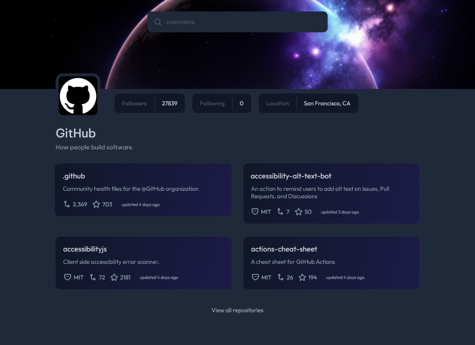
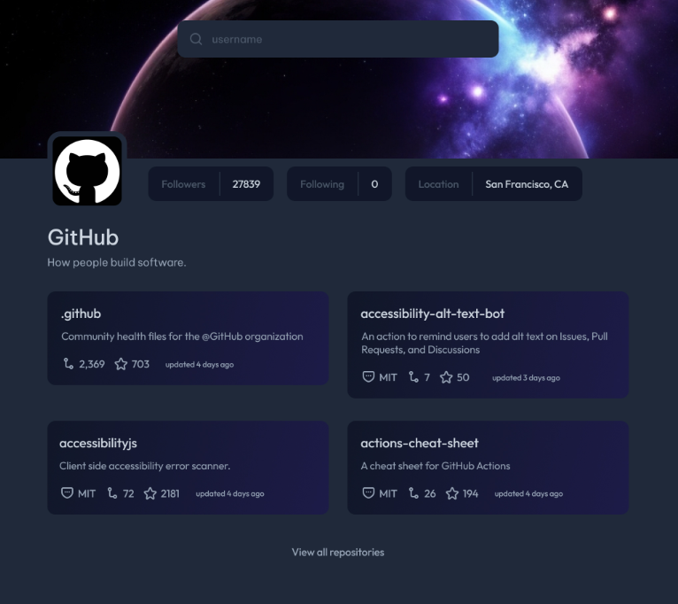
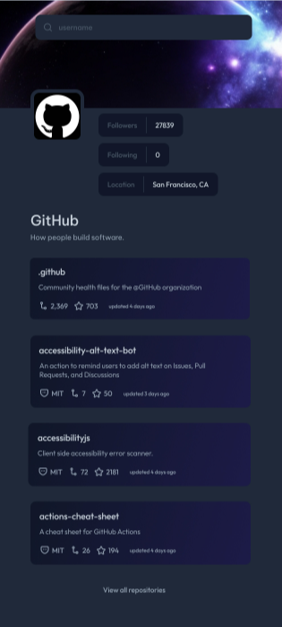

# Project Title

GitHub Profile

## Description

Search up any GitHub profile, and it will show their repo, name, followers, location, etc. And you can click on any repo, and it will direct you to their GitHub page. 

## Features

- View all repositories
- Search any GitHub profile
- 4 containers of repo

## Screenshots

## Technologies Used

- React
- CSS

## Installation

1.Clone my project > 2.Open any coding software > 3.CD (Change directory) to "my-app" in the terminal > 4.Run "NPM start" in the terminal

## Usage

Search any GitHub page, and click any repo or view all repositories.

## Learned

This is my first time doing a react project, I'm still currently taking a course of it. When I was about to finish my css, I realize that I didn't learn any react js.Because I want to make sure that I was not fully ahead in the course, and not applying it in my project. Basically, I want to take of what I learned from the course, and start applying it into my project, right away. I'm still on the beginner basics, I know what technique that I must use, for recently, I learned props. And I know that I must use it for the API. I got helped for I don't know many of these stuff, I understand what the code is trying to do, and I can't not wait to discover many more in react!

## License

This project is licensed under the [MIT License](LICENSE).